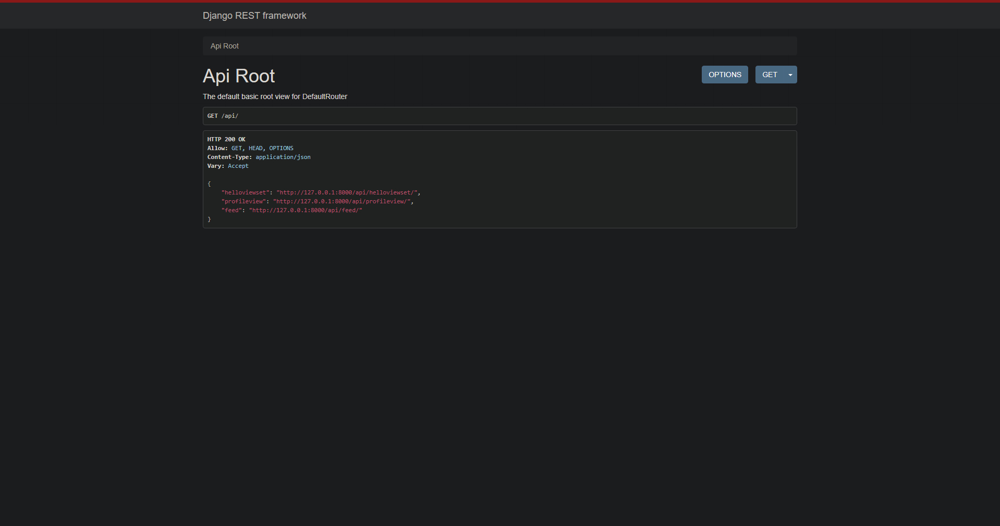

# REST API:-
- Created a REST-API using the Django rest framework to authenticate users using JWT.
- Major HTTP methods such as GET, PUT, DELETE, PATCH, PUT were used.
- User can post a feed and only authenticated users can see the feed. 
- Used Vagrant to set up the virtual server.
- Used the mockheader chrome extension to mock the authorization using the token.

# Screenshots:-

Here is the list of all the urls.

Login page:

After logging in:

Adding a new status:

After adding new status:

